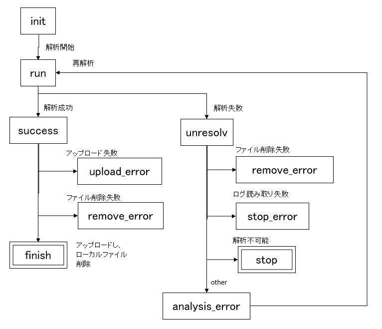

[](https://travis-ci.com/github/aokad/otomo)


# otomo

## 1. Dependency

 - awscli
 - boto3
 - sqlite3
 - requests
 - qacct (Sun Grid Engine)
 - parallel (Linux command)

## 2. Install

```Bash
git clone https://github.com/aokad/otomo.git
cd otomo
python setup.py build install
```

Set aws account (If you want to upload output files to aws S3)
```
aws configure
...
```

## 3. QuickStart

### 1) setup

Create SQLiteDB
```
$ otomo setup --wdir ${gcat_workflow_work_dir}
```

vi config file (option)
```
$ vi ~/.otomo.cfg

[notify]
slack_url = 
channel = 
label = 

[upload]
endpoint_url = 
profile = 
```

Add samples
```
$ otomo regsample --samples ${samples.json}
```

```
$ cat ${samples.json}
{
    "ERP001942_ERR205022" :
    {
        "study": "ERP001942",
        "runid": "ERR205022",
        "upload": 
        {
            "expression/ERP001942_ERR205022/ERP001942_ERR205022.txt.fpkm":                 s3://BUCKET/sra/expression/ERP001942_ERR205022/ERP001942_ERR205022.txt.fpkm,
            "expression/ERP001942_ERR205022/ERP001942_ERR205022.txt.gz":                   s3://BUCKET/sra/expression/ERP001942_ERR205022/ERP001942_ERR205022.txt.gz,
            "expression/ERP001942_ERR205022/ERP001942_ERR205022.txt.summary":              s3://BUCKET/sra/expression/ERP001942_ERR205022/ERP001942_ERR205022.txt.summary,
            ...
        },
    },
...
}
```

### 2) Running Job

Set Sample Status
```
$ otomo analysis --sample ${sample} --status ${status} \
  --description ${description} \
  --error_message ${error_message} \
  --stop_reason ${stop_reason}
```

 - status ...
    init/run/success/failure/stop/finish/analysis_error/upload_error/remove_error



option
 - decsription
 - error_message
 - stop_reason

Set Job Status
```
$ qacct -j "*" -o USER -d 1 > ./qacct.txt
$ otomo regjob --qacct ./qacct.txt
```

Upload output files to object storage
```
$ otomo upload --max [1000]
```

### 3) Job Report

Add job info
```
$ qacct -j "*" -o OWNER -d 1 > ./qacct.txt
$ otomo regjob --qacct ./aqcct.txt
```

View report
```
$ otomo qreport ${option}
```

Options
 - -f: failure only
 - -b begin_time: jobs started after
 - --max NUMBER: limited display jobs

## 4. License 

See document [LICENSE](./LICENSE).
